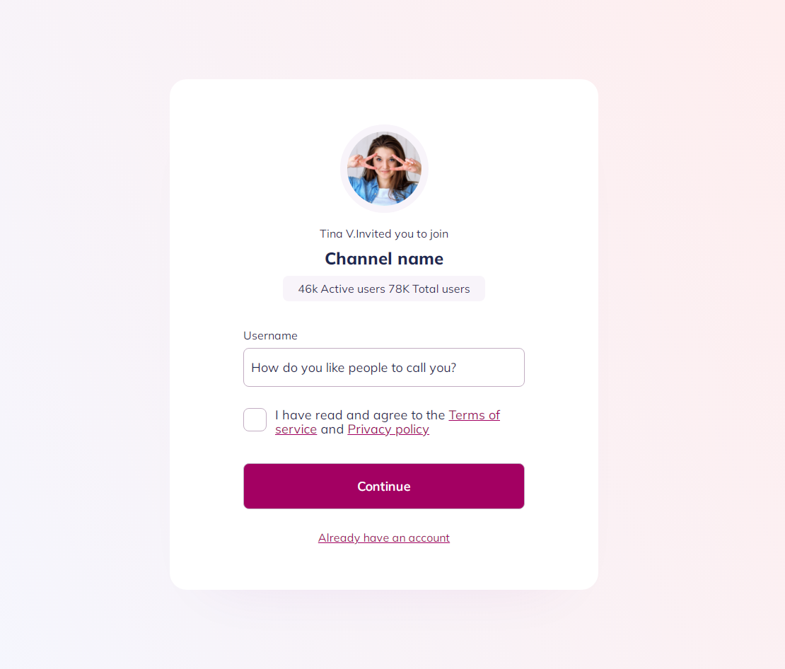

<h1 align="center"> Sign Up React </h1>

<p align="center">
    
</p>

## Descrição

O projeto foi baseado no layout da [ildiesign](https://www.behance.net/ildiesign) responsavel pelo site UIDesignDaily.com que contem varios projetos de UI Design gratuitos. No desenvolvimento da aplicação foi utilizado a biblioteca React que foi criada pela empresa Meta (antiga facebook) com o objetivo de criar interfaces de usuário em páginas web.


## Instalação Local

Para executar esse projeto você precisara do [Node](https://nodejs.org/en/).

Por meio dele sera baixado todas as depedencias do projeto, depois de instalado execute os comandos abaixo na linha do terminal.

1) para baixa todas as dependencias do projeto

```bash  
npm install
```

5) Execute o comando abaixo no terminal
```bash 
npm start
```


## Status do Projeto

**Concluido**: O projeto esta terminado, não havera futuras alterações de funcionalidade.


## Construído com

* [React](https://pt-br.reactjs.org/) - O React é uma biblioteca JavaScript de código aberto com foco em criar interfaces de usuário em páginas web. É mantido pelo Facebook, Instagram, outras empresas e uma comunidade de desenvolvedores individuais. É utilizado nos sites da Netflix, Imgur, Feedly, Airbnb, SeatGeek, HelloSign, Walmart e outros. .

## Versão das Linguagens e Ferramentas

#### Geral

* React: 17.0.2

## Autor

* **Cesar dos Santos de Almeida** - *responsável pela construção e desenvolvimento do projeto*

## Licença

Este projeto está licenciado sob a licença MIT - consulte o arquivo [LICENSE.md](LICENSE.md) para obter detalhes


## Links

* [Layout](https://www.uidesigndaily.com/posts/figma-sign-up-authentication-day-1528) - Link do site UIDesignDaily.com 
* [Demo](https://stoic-jang-a2a637.netlify.app/) - Link de demonstração


## Agradecimentos Especiais

* [Ildiko Gaspar](https://www.behance.net/ildiesign) - Autora e Criadora do site UIDesignDaily.com 


